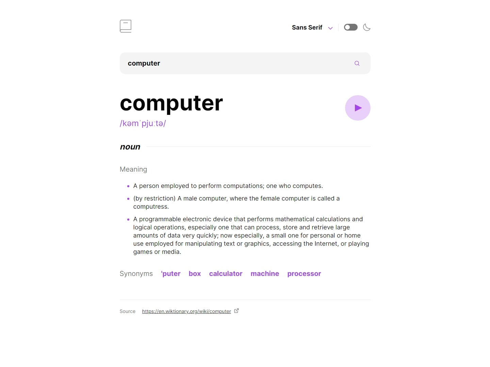

# Frontend Mentor - Dictionary web app solution

This is a solution to the [Dictionary web app challenge on Frontend Mentor](https://www.frontendmentor.io/challenges/dictionary-web-app-h5wwnyuKFL). Frontend Mentor challenges help you improve your coding skills by building realistic projects.

## Table of contents

- [Overview](#overview)
  - [The challenge](#the-challenge)
  - [Screenshot](#screenshot)
  - [Links](#links)
- [My process](#my-process)
  - [Built with](#built-with)
  - [What I learned](#what-i-learned)
- [Author](#author)

**Note: Delete this note and update the table of contents based on what sections you keep.**

## Overview

### The challenge

Users should be able to:

- Search for words using the input field
- See the Free Dictionary API's response for the searched word
- See a form validation message when trying to submit a blank form
- Play the audio file for a word when it's available
- Switch between serif, sans serif, and monospace fonts
- Switch between light and dark themes
- View the optimal layout for the interface depending on their device's screen size
- See hover and focus states for all interactive elements on the page
- **Bonus**: Have the correct color scheme chosen for them based on their computer preferences. _Hint_: Research `prefers-color-scheme` in CSS.

### Screenshot

### Links

- Solution URL: [Github](https://github.com/giobooo/giovannibrienzaftm/tree/main/008_dictionary-web-app)
- Live Site URL: [Github Pages](https://giobooo.github.io/giovannibrienzaftm/008_dictionary-web-app/build/)

## My process

### Built with

- Semantic HTML5 markup
- CSS custom properties
- SASS/SCSS
- Flexbox
- Mobile-first workflow
- Javascript
- [React](https://reactjs.org/) - JS library

### What I learned

This challange was extremely useful. I learned how to style efficiently for light and dark themes and for font changes. I actually am very proud of how little extra code I wrote to achieve this.
I feel much confident in how to deal with different screen sizes.

This was also the first time I used with deep understanding "map" and conditional rendering in React.

## Author

- Website - [Giovanni Brienza](https://www.giobrienza.com)
- Frontend Mentor - [@giobooo](https://www.frontendmentor.io/profile/giobooo)
- Twitter - [@giobooo](https://www.twitter.com/giobooo)
