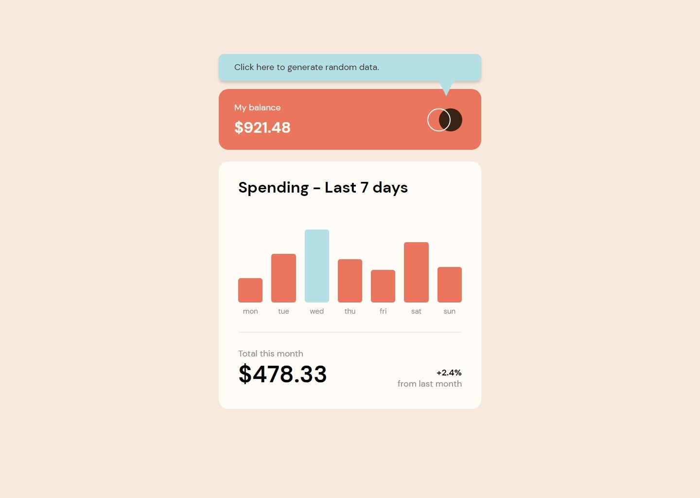

# Frontend Mentor - Expenses chart component solution

This is a solution to the [Expenses chart component challenge on Frontend Mentor](https://www.frontendmentor.io/challenges/expenses-chart-component-e7yJBUdjwt). Frontend Mentor challenges help you improve your coding skills by building realistic projects.

## Table of contents

- [Overview](#overview)
  - [The challenge](#the-challenge)
  - [Screenshot](#screenshot)
  - [Links](#links)
- [My process](#my-process)
  - [Built with](#built-with)
  - [What I learned](#what-i-learned)
- [Author](#author)

**Note: Delete this note and update the table of contents based on what sections you keep.**

## Overview

### The challenge

Users should be able to:

- View the bar chart and hover over the individual bars to see the correct amounts for each day
- See the current day’s bar highlighted in a different colour to the other bars
- View the optimal layout for the content depending on their device’s screen size
- See hover states for all interactive elements on the page
- **Bonus**: Use the JSON data file provided to dynamically size the bars on the chart

### Screenshot



### Links

- Solution URL: [Frontend Mentor](https://www.frontendmentor.io/solutions/expensive-chart-responsive-and-with-a-random-data-generator-idFHOMxDoO)
- Live Site URL: [Github Pages](https://giobooo.github.io/giovannibrienzaftm/011_expenses-chart-component/dist/)

## My process

### Built with

- Semantic HTML5 markup
- CSS custom properties
- Flexbox
- Mobile-first workflow
- SASS
- Typescript

### What I learned

I did't know how simple it is to create an array using map function.
I also didn't know about the max function of Math to return the highest value in an array.
And finally i didn't know that you could create an array directly from Array.from.

```js
const expensesData: Array<number> = data.map((p) => p.amount);
//------------------------------------------------------------------
const maxNum = Math.max(...array);
//------------------------------------------------------------------
SetData(Array.from({ length: 7 }, () => Math.random() * 100));
```

## Author

- Website - [Giovanni Brienza](https://www.giobrienza.com)
- Frontend Mentor - [@giobooo](https://www.frontendmentor.io/profile/giobooo)
- Twitter - [@giobooo](https://www.twitter.com/giobooo)
